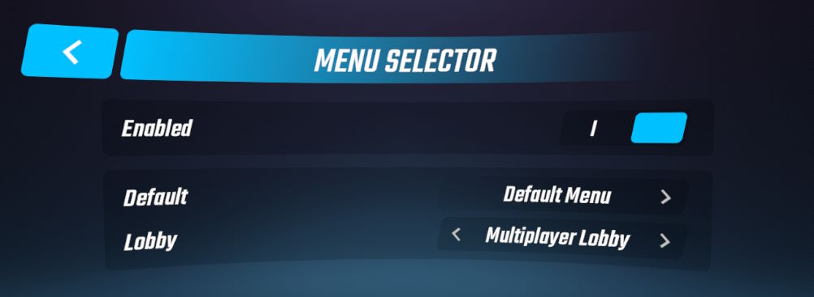

# MenuSelector
 PC Beat Saber plugin that adds the option to switch between the different built-in menu environments.

## Manual Installation
> [!IMPORTANT]
> In addition to BSIPA, you must have [SiraUtil](https://github.com/Auros/SiraUtil) and [BeatSaberMarkupLanguage](https://github.com/monkeymanboy/BeatSaberMarkupLanguage) installed for this mod to load. Install them using your mod manager i.e. [BSManager](https://bsmg.wiki/pc-modding.html#bsmanager).

Place the contents of the unzipped folder from the latest [release](https://github.com/qqrz997/MenuSelector/releases/latest) into your Beat Saber installation folder. If you need more information regarding manual installation of mods [this wiki page](https://bsmg.wiki/pc-modding.html#manual-installation) will help. For further help with installing mods, join the [Beat Saber Modding Group](https://discord.gg/beatsabermods) discord server.

Older versions of MenuSelector are not supported. If you find issues using an older version then I won't be able to help.

## Usage
Locate the "Menu Selector" button in the left of the main menu to access the Menu Selector screen.

